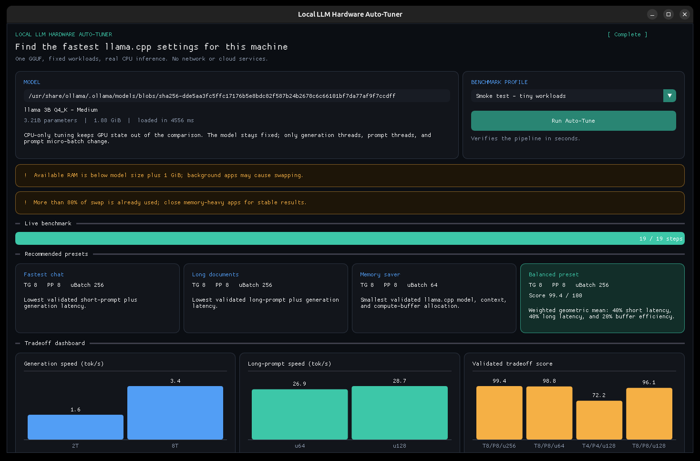

# Local LLM Hardware Auto-Tuner

A self-contained C++17 hackathon demo that finds good `llama.cpp` runtime settings for one
local GGUF model. It benchmarks generation threads, prompt-processing threads, and prompt
micro-batch size, then shows the speed/memory tradeoff in a live Dear ImGui dashboard.

This is **one-GGUF CPU runtime auto-tuning**, not a multi-quantization, perplexity, or
output-quality comparison. `n_gpu_layers` is deliberately fixed to zero.

This is the machine-friendly alternative to a four-quantization benchmark: it uses the
Llama 3.2 3B Q4_K_M model already installed by Ollama on this computer, so it needs no new
model download and no cloud service.



## Build and run

On this Ubuntu 24.04 x86-64 machine, GLFW/OpenGL development files are vendored in the
project, so no `sudo` or package installation is needed.

The build copies the two required GUI runtime libraries into `build/gui-libs` and uses a
relative runtime path. If you move the built executable, keep that directory beside it.

Prerequisites are CMake 3.20 or newer, a C++17 compiler, and an active X11/XWayland display.
The bundled GUI libraries specifically target Ubuntu Noble x86-64.

```bash
git clone --recurse-submodules https://github.com/Faisal01011/llama-autotune.git
cd llama-autotune
cmake -S . -B build -DCMAKE_BUILD_TYPE=Release
cmake --build build -j
./build/llama-autotune
```

The last command opens the dashboard. The default model path is specific to this machine
and points at its local Ollama blob:

```text
/usr/share/ollama/.ollama/models/blobs/sha256-dde5aa3fc5ffc17176b5e8bdc82f587b24b2678c6c66101bf7da77af9f7ccdff
```

Use another decoder-only GGUF without renaming or copying it:

```bash
./build/llama-autotune --gui --model /absolute/path/to/model.gguf
```

The model weights are not bundled with this source tree.

## Demo flow

1. Launch `./build/llama-autotune`.
2. Keep the **Quick** profile selected and click **Run Auto-Tune**.
3. Watch completed candidates stream into the table and charts.
4. Compare the Fastest Chat, Long Documents, Memory Saver, and Balanced presets.
5. Use **Cancel** during a run; llama.cpp's CPU abort callback promptly stops an active
   decode. Initial model/context loading may still take a moment to return.

Quick mode uses one exploratory repetition and three repetitions for each complete finalist
preset. Thorough mode uses three exploratory and five finalist repetitions. Smoke mode uses
tiny workloads to verify the complete pipeline in about a minute on this machine.

## CLI modes

The same executable retains reproducible command-line paths:

```bash
# Real single-prompt inference
./build/llama-autotune --single --prompt "Explain local AI in one sentence" --tokens 8

# Full auto-tuning sweep and table
./build/llama-autotune --sweep

# Short real-model verification
./build/llama-autotune --smoke

# Automated GUI pipeline verification
./build/llama-autotune --gui-smoke --exit-after-run
```

Run `./build/llama-autotune --help` for every option.

## What is measured

- Prompt-processing throughput, separately from autoregressive generation throughput.
- Wall-clock context creation, prompt processing, and generation using
  `std::chrono::steady_clock`.
- Actual logical/micro-batch values reported back by llama.cpp.
- llama.cpp model, context, and compute-buffer allocations.

The normal Quick workload is fixed at 64 prompt tokens for chat behavior and 384 prompt
tokens for long-prompt behavior, with 8 greedy generation steps. Tokenization is outside the
timed region. Every prompt decode is synchronized before its timer stops. Candidate order is
deterministically shuffled to reduce fixed thermal-order bias, and finalist presets are
remeasured on both workloads.

The coordinate search tests generation/prompt thread counts `{2, 4, 8, 16}` and prompt
micro-batches `{64, 128, 256, 512}` when the machine and logical batch permit them. It is a
small practical search, not an exhaustive optimizer. Model load, tokenization, and context
creation are reported separately and excluded from the tradeoff score; the model stays loaded
once throughout a sweep.

The balanced score is intentionally transparent:

```text
100 × (best_short_latency / candidate_short_latency)^0.40
    × (best_long_latency  / candidate_long_latency )^0.40
    × (lowest_buffers     / candidate_buffers     )^0.20
```

It means “best for these workloads on this hardware,” not a universal model ranking.
Allocated buffers come from the pinned `llama-ext.h` staging API and are not peak process
RAM. The dashboard labels them accordingly.

## Error handling and resource limits

- Missing/unreadable model paths are reported without a crash.
- Encoder-decoder and non-generative GGUFs are rejected with a clear message.
- Context allocation and decode failures identify the failed candidate; recoverable
  candidate failures preserve partial results and the rest of the sweep continues.
- Cancellation reaches an in-progress CPU graph through llama.cpp's abort callback.
- Low available RAM and high swap use appear as warnings before and after the run.

The current Ryzen 7 4800H machine has only about 7.2 GiB of usable RAM and heavily used
swap. Close browsers or other memory-heavy applications before recording final numbers.
`GGML_NATIVE=ON` also makes the benchmark binary and its results CPU-specific; rebuild on the
machine being demonstrated.

## Dependencies and pins

- `llama.cpp`: `58546250cfaa1dc4a33ae6171dbe4344a96206e8`
- Dear ImGui: `0af8f475d1cf8b98d603702059c0c73deeb81ac2`
- GLFW: Ubuntu Noble 3.3.10 package, vendored for this x86-64 demo build
- GLVND/OpenGL: Ubuntu Noble 1.7.0 packages, vendored for this x86-64 demo build

The llama.cpp and Dear ImGui source trees are under `third_party/`. The small binary
GLFW/GLVND prefix exists because this machine lacks development packages and `sudo` is not
available non-interactively. Other platforms can install GLFW/OpenGL normally or build the
CLI-only target:

```bash
cmake -S . -B build-cli -DCMAKE_BUILD_TYPE=Release -DAUTOTUNE_BUILD_GUI=OFF
cmake --build build-cli -j
```

See `THIRD_PARTY_NOTICES.md` for license locations.

## Verification

```bash
ctest --test-dir build --output-on-failure
./build/llama-autotune --smoke
./build/llama-autotune --gui-smoke --exit-after-run
```

CTest covers help, configuration validation, and missing-model errors. The smoke commands are
the real-model integration tests.

All inference paths call the real llama.cpp C API; there are no mock results or external
services.
